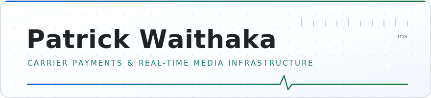

<picture>
  <source media="(prefers-color-scheme: dark)" srcset="assets/header-dark.svg">
  
</picture>

I build and operate payment and subscription infrastructure inside carrier networks, Safaricom, Airtel, MTN and others, and programmatic media systems where buying decisions execute in milliseconds. Both domains share one property: errors settle instantly, like physics. There is no appeals process, so the engineering has to be correct before the traffic arrives.

 

### Carrier infrastructure

Direct integrations with operator billing and subscription platforms across multiple markets. Full lifecycle ownership: integration design, charge and settlement flows, subscriber consent, reconciliation, fraud detection, including anomalies that dedicated fraud teams had missed. Built assuming components fail, engineered to recover without intervention, reconciled to the shilling.

### Real-time media

Programmatic operations where the auction closes before a human could react. The controlling constraint is not speed; it is correctness at speed. Every impression validated as human, every supply chain verified, not assumed. The gap between 99% and 100% is not one percent of outcomes; it is the entire margin, and I engineer against it as the primary design requirement.

### Commercial execution

I negotiate my own carrier integrations: cold start to signed agreement to live revenue. Every term signed with an operator or stakeholder has been met, without exception, for the life of the agreement. It is why integrations built years ago are still running and still growing.

 

> The systems I value most generate no incidents, no escalations, no conversation. **Quiet is the deliverable.**

---

Nairobi · Working worldwide · [patrick@edhanse.com](mailto:patrick@edhanse.com)

